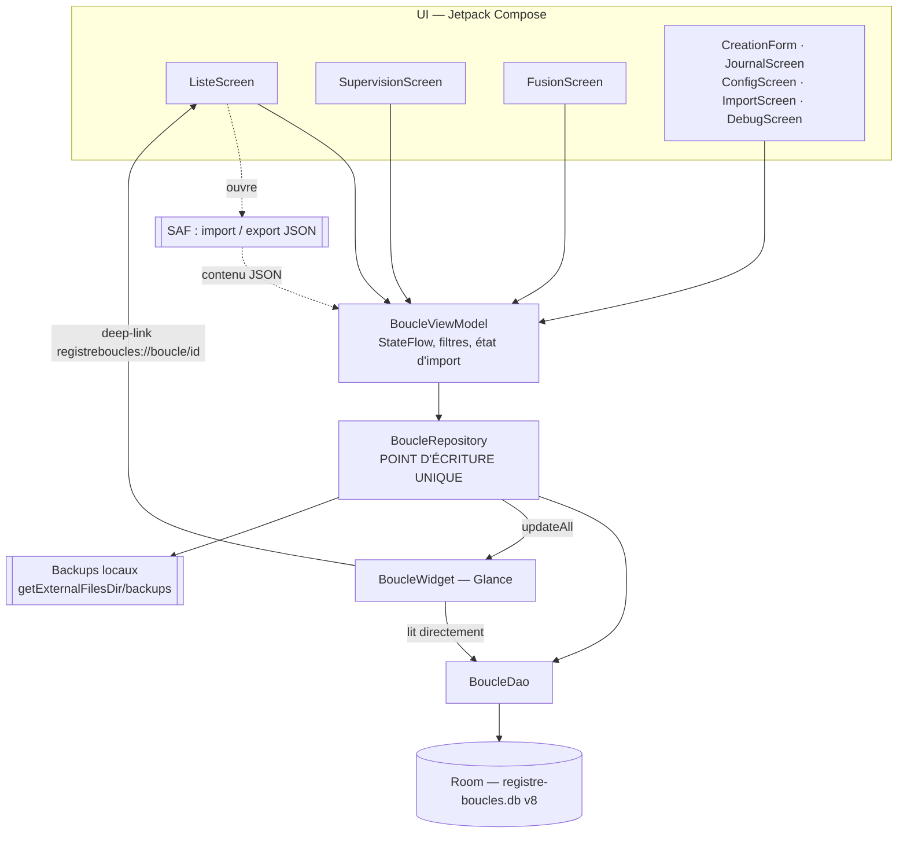

# Architecture

Application Android native mono-module, **hors ligne**, sans injection de
dépendances ni couche réseau. Kotlin · Jetpack Compose · Room · Glance.
minSdk 26 / compileSdk 34.

---

## 1. Vue d'ensemble

Flux nominal : l'UI n'écrit jamais en base directement ; elle appelle le
`ViewModel`, qui appelle le `Repository`, seul à parler au DAO.

**Exception documentée :** le widget **lit** la base directement
(`BoucleWidget.provideGlance` → `AppDatabase.get(context).boucleDao()`), sans
passer par le Repository. C'est une lecture seule, dans un process qui n'a pas
de `ViewModel`. Son unique **écriture** (bouton Clôturer de la carte) passe bien
par `repository.cloturer(...)`, donc par l'invariant I1.

---

## 2. Le Repository, point d'écriture unique

`BoucleRepository` concentre toutes les écritures. Ce n'est pas de la
cosmétique en couches : c'est ce qui rend trois garanties possibles.

1. **Le widget ne peut pas se désynchroniser.** Chaque méthode qui touche à la
   table `boucles` termine par `rafraichirWidget()` →
   `BoucleWidget().updateAll(appContext)` (9 points d'appel : création, mise à
   jour, suppression, clôture, accepter, rejeter, et les trois imports). Aucun
   écran n'a à y penser.
   *Nuance :* `ajouterMouvement()` ne rafraîchit **pas** le widget — un mouvement
   ne change ni les compteurs ni les échéances affichés.
2. **Le backup ne peut pas être oublié** (invariant I4) : les imports et les
   actions de supervision appellent `creerBackupStrict()` en première ligne. Si
   l'écriture était dispersée dans les écrans, cette garantie serait à
   re-vérifier à chaque nouvel écran.
3. **La coercition IA ne peut pas être contournée** (invariant I6) : elle est
   appliquée dans les trois méthodes d'import, pas dans l'UI qui les déclenche.

Le `Repository` est instancié une fois dans `RegistreApplication.onCreate()` et
exposé en propriété ; `MainActivity` le récupère pour construire le `ViewModel`
via une `Factory`. Pas de framework DI.

---

## 3. La logique métier vit dans des fonctions pures

Le cœur des règles est écrit en fonctions **sans dépendance Android** :

| Fonction | Fichier | Rôle |
|---|---|---|
| `executerTransitionTerminale` / `executerCloture` | `Cloture.kt` | Écriture d'un état terminal (via l'interface `ClotureStore`, pas le DAO) |
| `accepterProposition`, `mouvementAcceptation` | `Cloture.kt` | Acceptation d'une proposition + sa trace |
| `calculerFusion`, `calculerConflits` | `Fusion.kt` | Fusion additive et diff d'arbitrage |
| `coercerPropositionsIA` | `Coercition.kt` | Coercition des propositions IA |
| `genererProchainId`, `idConforme` | `Identifiants.kt` | Prochain identifiant du préfixe de cet appareil |
| `normaliserCodeAppareil`, `codeAppareilSuggere` | `CodeAppareil.kt` | Validation du code appareil et suggestion au premier lancement |
| `traceSuppression` | `Suppression.kt` | Trace de suppression (tombstone) |
| `calculerFusionSync`, `appliquerPlan`, `evenementDepuisPlan`, `avanceHorloge` | `FusionSync.kt` | Fusion bidirectionnelle : le plan est **calculé** ici, appliqué par le repository. Rend testables l'idempotence et la symétrie |
| `nomFichierEtat`, `codeDepuisNomFichier` | `DossierSync.kt` | Nommage des fichiers d'état (I11) |
| `normaliserPourEmpreinte`, `empreinteCapture`, `tronquerCapture` | `EmpreinteCapture.kt` | Déduplication des captures : mesure du texte, jamais interprétation |
| `preparerCapture` | `PreparationCapture.kt` | Décision d'entrée d'une note (créer / doublon / refus), sans effet de bord |
| `transitionsCapturesApresSupervision`, `mentionOrigines` | `SupervisionCaptures.kt` | Effet d'une acceptation ou d'un rejet sur les captures d'origine (I16) |
| `lienCapture`, `liensDepuisOrigines` | `CaptureBoucle.kt` | Construction des liens capture -> boucle |
| `genererIdCapture`, `genererIdCaptureUnique` | `IdentifiantCapture.kt` | Identifiant de capture, sans coordination entre appareils |
| `doitReutiliserBackup`, `ageBackupDepuisNom` | `Backup.kt` | Décision d'anti-rafale |
| `Statut` / `Milieu` / `SourceBoucle` + extensions | `Statut.kt`, … | Prédicats du cycle de vie |
| `estEnRetard`, `estEcheanceProche`, `joursRestantsDepuis` | `Echeance.kt` | Catégories d'échéance du tableau de bord (date du jour en paramètre, donc testables) |

**Pourquoi.** Ces fonctions sont testables en **JVM pure**, sans émulateur ni
appareil : `./gradlew test` tourne en quelques secondes et **en CI**, sur chaque
push. C'est ce qui permet aux 141 tests de garder les invariants. Un test
d'instrumentation Android aurait coûté un émulateur en CI et n'aurait
probablement jamais tourné.

Le procédé type : `executerCloture` ne connaît pas Room, seulement l'interface
`ClotureStore` (3 méthodes). Le `Repository` en fournit une implémentation
adossée au DAO ; les tests en fournissent une fausse en mémoire.

---

## 4. Rôle de chaque écran

| Écran | Rôle |
|---|---|
| `ImportScreen` | Premier lancement, base vide : import du JSON initial (c'est le seul écran affiché tant que `baseVide == true`). |
| `ListeScreen` | Écran principal : tuiles de stats, filtres statut/milieu, recherche, cartes accordéon, FAB de création, badge Supervision, dialogues d'import/mouvement/clôture. |
| `SupervisionScreen` | File des propositions `PROPOSEE` : accepter / amender / rejeter. |
| `FusionScreen` | Arbitrage des conflits d'un import « Fusionner » (garder l'existant / prendre l'entrant), affiché en plein écran tant qu'une fusion est en cours. |
| `CreationForm` | Formulaire en bottom sheet, **création ou édition** selon le paramètre `boucleAModifier`. |
| `JournalScreen` | Historique des entrées de journal d'une boucle (les preuves de clôture). |
| `ConfigScreen` | Réglages : valeurs des listes Type/Tiers, « Sauvegarder maintenant », « Exporter le dernier backup ». |
| `DebugScreen` | Affiche `crash.log` (appui long ~2 s sur le titre de la liste). |

Navigation : `RegistreNavHost` (Navigation Compose) avec 5 routes —
`liste`, `supervision`, `config`, `journal/{id}`, `debug`. La création,
l'édition et l'arbitrage de fusion ne sont **pas** des routes : bottom sheets et
overlay dans `ListeScreen`.

---

## 5. Widget Glance

`BoucleWidgetReceiver` (déclaré au manifeste) → `BoucleWidget`.
Il lit `compterActives()` et `prochainesEcheances(30)`, donc n'affiche que des
boucles **actives avec une échéance** (les propositions et les boucles sans
échéance en sont absentes, par construction — invariant I3).

Deux interactions :
- tap sur une carte → deep-link `registreboucles://boucle/{id}` (`?mvt=1` pour
  ouvrir directement l'ajout de mouvement), intercepté par `MainActivity`
  (`launchMode="singleTop"` + `onNewIntent`) et transmis au `ViewModel` ;
- bouton Clôturer → `ClotureActionCallback` → `repository.cloturer(...)` :
  la clôture depuis le widget respecte l'invariant I1 (elle écrit un journal
  « Clôturé depuis le widget », type `DECLARATION`).

---

## 6. Import / export : Storage Access Framework

Aucun accès libre au système de fichiers de l'utilisateur : tout passe par les
contrats d'activité (`OpenDocument` / `CreateDocument`), donc par un sélecteur
système. Les backups automatiques, eux, vivent dans le stockage **app-scoped**
(`getExternalFilesDir(null)/backups`), sans permission runtime, et sont inclus
dans la sauvegarde système Android (`backup_rules.xml`,
`data_extraction_rules.xml`).

---

## 7. Thème et couleurs

Charte « Encre & Patine ». Deux niveaux :

- les emplacements **Material 3** (`MaterialTheme.colorScheme`) pour tout ce qui
  a un équivalent standard : `primary` = patine, `background`, `surface`,
  `outline`, `onSurfaceVariant`, `error` ;
- un **`CompositionLocal`** (`Mnemosyne.couleurs`, cf. `ui/theme/Theme.kt`) pour
  les accents propres à la marque, qui **diffèrent entre clair et sombre** et
  n'ont pas d'emplacement M3 : `barre`, `surBarre`, `logoBarre`, `accent`,
  `accentDoux`, `retard`, `bientot`, `texteDoux`, `separateur`, `fab`, `surFab`.

C'est ce second niveau qui remplace les anciennes constantes globales
(`Marine`, `Teal`, `Alerte`, `Warn`) : celles-ci étaient fixes dans les deux
thèmes, ce que la charte actuelle ne permet plus.

Le **widget** ne peut pas lire le thème Compose de l'app (autre process, pas de
`ViewModel`) : il porte sa propre `PaletteWidget(sombre)`, alignée sur les mêmes
valeurs. Toute évolution de palette doit être répercutée aux deux endroits.

## 8. Persistance annexe

`SharedPreferences` (`registre-prefs`) pour le mode sombre et les valeurs des
listes Type/Tiers (`ListeOptions`, sérialisées en JSON). Un `crash.log` est
écrit dans `filesDir` par un handler d'exceptions installé dans
`RegistreApplication` — qui **relance toujours** le handler système ensuite
(le crash n'est jamais avalé).

---

## 9. Dette technique assumée

Elle est nommée ici pour ne pas être redécouverte :

1. **`ListeScreen.kt` fait 945 lignes.** Écran principal + 4 dialogues + cartes
   + filtres + overlay de fusion dans un seul fichier. Découpage identifié comme
   un lot dédié, à faire **en préambule de la prochaine évolution UI**, pas en
   passant.
2. **Aucun test de migration Room.** Les schémas v3 à v8 sont versionnés
   dans `app/schemas/`, mais vérifier une migration réelle exige un `androidTest`
   sur émulateur. Les migrations 1→2 … 7→8 sont de simples `ALTER
   TABLE ADD COLUMN` / `CREATE TABLE`, et `fallbackToDestructiveMigration` n'est pas
   activé : une migration défaillante ferait échouer l'ouverture de la base
   (crash visible), elle n'effacerait pas les données.
3. **Aucun test d'UI.** Les affichages (marqueur « statut inconnu », badge de
   supervision, diff de fusion) ne sont vérifiés que visuellement.
4. **Le `Repository` n'est pas testé unitairement** (il dépend de Room et d'un
   `Context`). Les garanties « backup avant écriture » et « coercition appelée
   par les trois imports » reposent sur la lecture du code, pas sur un test.
5. **`JournalType.depuis()` est du code mort** et le type d'entrée de journal
   n'est pas validé à l'import (cf.
   [`../reference/data_model.md`](../reference/data_model.md) §5.4).
6. **Warning lint non corrigé** : `StateFlowValueCalledInComposition` dans
   `ListeScreen` (libellé du menu mode clair/sombre lu via `.value` en
   composition). Lint est mesuré en CI mais non bloquant (`abortOnError = false`).
